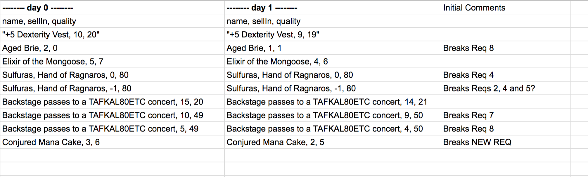

# Gilded Rose Refactoring Kata in Ruby

This is a practice tech test to assess my ability to read, refactor and extend legacy code in Ruby. The original Repo can be found https://github.com/emilybache/GildedRose-Refactoring-Kata

## Getting started

Enter the following commands in your terminal to download the program:
- `git clone https://github.com/shezdev/GildedRose-Refactoring-Kata/tree/master/ruby`
- cd into ruby subdirectory
- Please run `bundle` to install the necessary ruby `gemfile` dependencies

## Usage
[(1) How to install it (what to clone, what to run to get all dependencies)]

`command_to_start` (e.g. `rackup` or `rails s`)
Navigate to `http://localhost:4567/`

[(2) How to run it (is it a command line tool? Do you have to load it into IRB? Is is a web application? What port needs to be used?)]

## Running tests

`test_command` (e.g. `rspec`)

Later on, you can add screenshots and additional information to your heart's content, but make sure you have this with all your repos as you proceed through the course. You will thank yourself later.
https://github.com/matiassingers/awesome-readme

## Background
This is a well known kata developed by Terry Hughes. This is commonly used as a tech test to assess a candidate's ability to read, refactor and extend legacy code.

Here is the text of the kata:

"Hi and welcome to team Gilded Rose. As you know, we are a small inn with a prime location in a prominent city run by a friendly innkeeper named Allison. We also buy and sell only the finest goods. Unfortunately, our goods are constantly degrading in quality as they approach their sell by date. We have a system in place that updates our inventory for us. It was developed by a no-nonsense type named Leeroy, who has moved on to new adventures. Your task is to add the new feature to our system so that we can begin selling a new category of items.

## Specification

### Current Requirements
First an introduction to our system:
- All items have a **SellIn value** which denotes the number of days we have to sell the item.
- All items have a **Quality value** which denotes how valuable the item is.
- At the end of each day our system **lowers both values for every item**.

Pretty simple, right? Well this is where it gets interesting:

1. Once the sell by date has passed, Quality degrades twice as fast
2. The Quality of an item is never negative
3. “Aged Brie” actually increases in Quality the older it gets
4. The Quality of an item is never more than 50
5. “Sulfuras”, being a legendary item, never has to be sold or decreases in Quality

 “Backstage passes”, like "aged brie" **increases** in Quality as it’s SellIn value approaches:
7. Quality increases by 2 when there are 10 days or less
8. Quality increases by 3 when there are 5 days or less
9. But Quality drops to 0 after the concert

### Additional Requirements
We have recently signed a supplier of conjured items. This requires an update to our system:
1. “Conjured” items degrade in Quality twice as fast as normal items

### Acceptance criteria
- Feel free to make any changes to the UpdateQuality method and add any new code as long as everything still works correctly.
- However, do not alter the Item class or Items property as those belong to the goblin in the corner who will insta-rage and one-shot you as he doesn’t believe in shared code ownership (you can make the UpdateQuality method and Items property static if you like, we’ll cover for you)."

### My Approach
- Assign a ref (number) to each requirement
- Run the program as is (`ruby texttest_fixture.rb`)
- See how the program matches the requirements, by copying the output from day 0 to day 1 in a spreadsheet:

